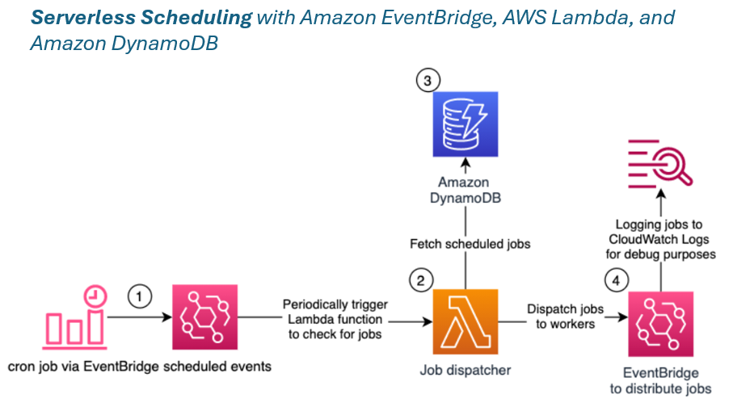
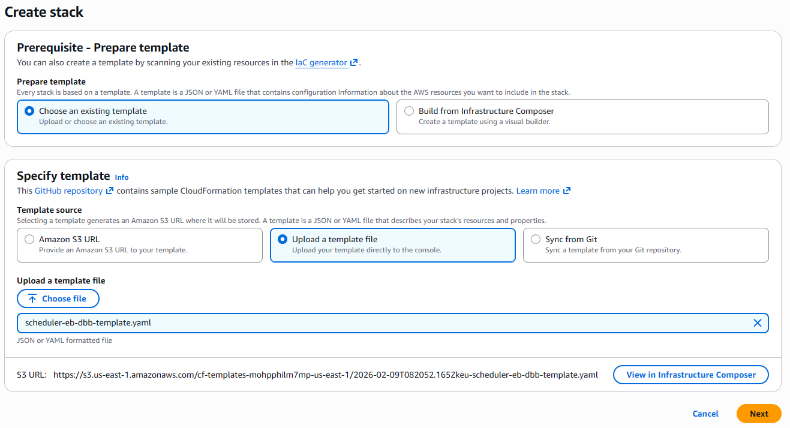
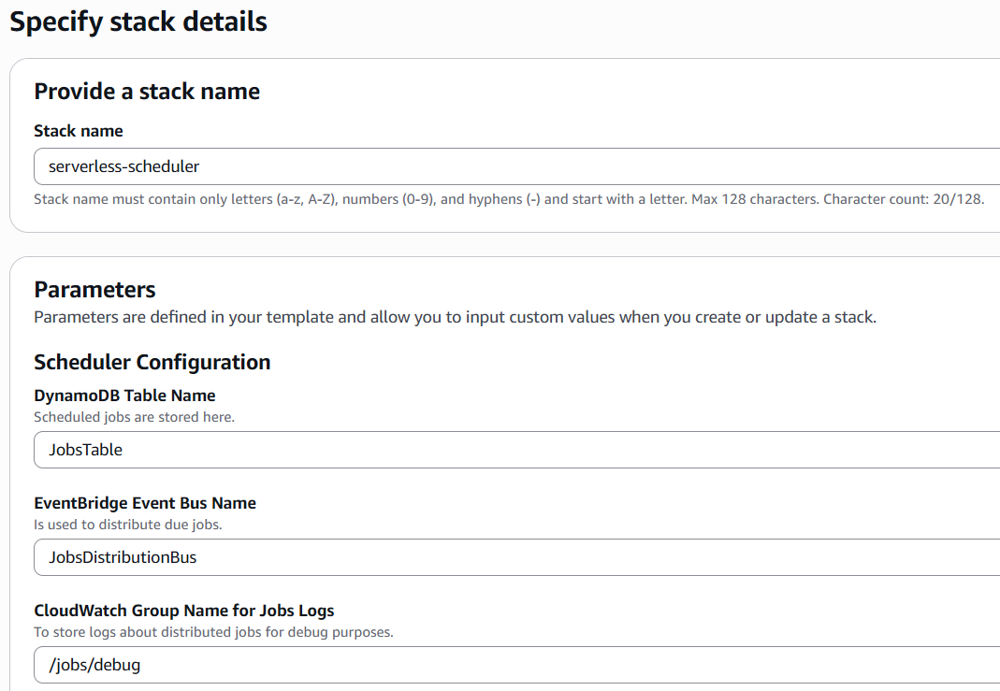
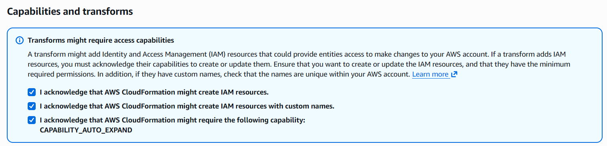
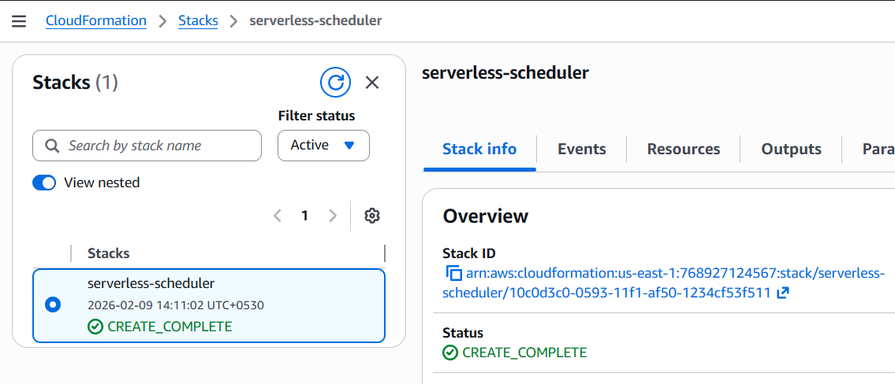
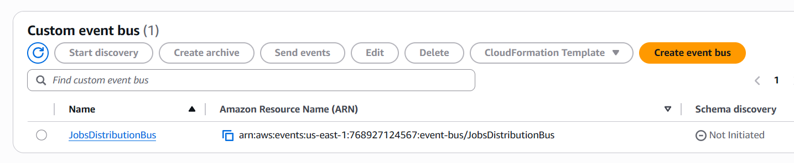
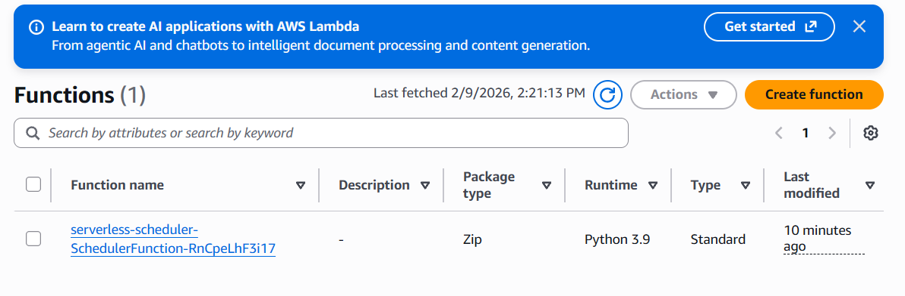
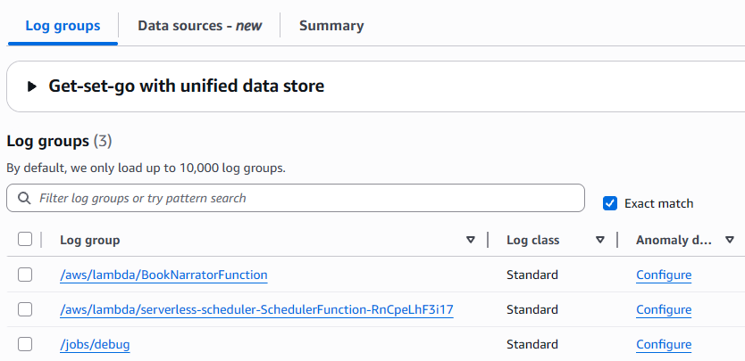
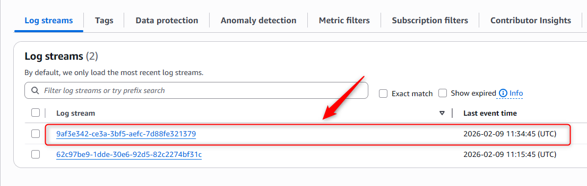
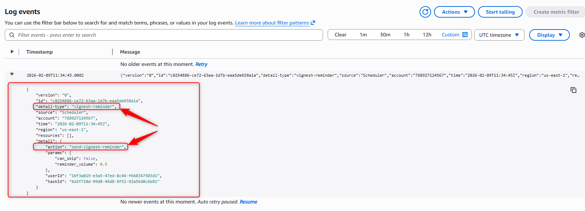

# Serverless Scheduler with EventBridge, Lambda, and DynamoDB
This project demonstrates the serverless job scheduler that uses EventBridge to trigger a Lambda function every minute, which queries DynamoDB for due jobs and distributes them via EventBridge to workers.

## The Traditional Challenge:
Imagine you're building an application that needs to:
- Send status report via emails at exactly 8 AM
- Publish blog posts at scheduled times (weeks in advance)
- Send flight reminders 8 hours before departure
- Change product prices at midnight on Black Friday
- Execute millions of one-time scheduled tasks

## Traditional approaches & their problems:
**Approach 1: Cron Jobs on Servers**
```bash
# Traditional cron job
0 8 * * * /usr/bin/send-emails.sh
```

**Problems:**
**Scalability:** Can't handle millions of different schedules
**Single Point of Failure:** Server goes down = all jobs fail
**Cost:** Server runs 24/7 even if no jobs
**Management:** Need to manage server, updates, security
**One-time jobs:** Cron is for recurring jobs, not flexible one-time schedules

**Approach 2: Cron Jobs on Servers**
```py
# Every minute, query database
while True:
    jobs = db.query("SELECT * FROM jobs WHERE due_time <= NOW()")
    for job in jobs:
        execute(job)
    time.sleep(60)
```

**Problems:**
**Database Load:** Continuous polling hammers your database
**Inefficient:** Scans entire table every minute
**Cost:** Database always under load
**Scaling:** Can't handle millions of jobs efficiently

**Approach 3: Task Queues (RabbitMQ, Celery)**
# Schedule task with Celery
```bash
send_email.apply_async(args=['user@email.com'], eta=datetime(2026, 2, 10, 8, 0))
```

**Problems:**
**Infrastructure:** Need to run RabbitMQ/Redis servers
**Memory:** All scheduled tasks in memory
**Scaling:** Limited by queue size and workers
**Persistence:** What if queue crashes?

## What This Serverless Architecture Achieves
- **Serverless** - No infrastructure to manage
- **Scalable** - Handles thousands of jobs per minute
- **Cost-effective** - Pay only for what you use
- **Reliable** - Fully managed AWS services
- **Flexible** - Easy to integrate with existing applications

# Architecture


## How It Works ?
1. **Job Storage:** Jobs are stored in DynamoDB with a partition key based on 5-minute intervals
2. **Periodic Check:** EventBridge triggers Lambda every minute
3. **Query & Process:** Lambda queries for due jobs and publishes them to EventBridge
4. **Distribution:** Workers consume jobs from EventBridge based on configured rules
5. **Cleanup:** Processed jobs are deleted from DynamoDB

## Services Used
- **Amazon EventBridge:** Amazon EventBridge is a serverless event bus that makes it easier to build event-driven applications at scale. It can also schedule events based on time intervals or cron expressions.
EventBridge has TWO different roles:
    **1. TIMER (Cron Replacement):** to periodically start the AWS Lambda function, which checks for new jobs to be executed, and
    **2. EVENT BUS (Message Router):** to distribute those jobs to the workers.

- **AWS Lambda:** To execute the scheduler logic. AWS Lambda is a serverless, event-driven compute service that lets you run code without provisioning or managing servers. The Lambda function queries the jobs from DynamoDB and distributes them via EventBridge.

- **Amazon DynamoDB:** To store scheduled jobs. Amazon DynamoDB is a fully managed, serverless, key-value NoSQL database designed to run high-performance applications at any scale.

- **Amazon EventBridge:** To distribute the jobs. The Lambda function uses Amazon EventBridge as an example to distribute the jobs. The workers which should receive the jobs, must configure the corresponding rules upfront. For testing purposes, this solution comes with a rule which logs all events from the Lambda function into Amazon CloudWatch Logs.

**What are "Workers"?**

**Workers** = The components that DO the actual work

Think of it like a restaurant:

- **Scheduler** = Manager (decides when to cook)
- **EventBridge** = Waiter (delivers orders)
- **Workers** = Chefs (actually cook the food)

**In this project:**

- **Worker in demo:** CloudWatch Logs (just logs events for debugging)
- **Workers in production:** Lambda functions that send emails, SMS, update databases, call APIs, etc.

**Example Workers:**
Each worker listens to EventBridge and only responds to events matching its pattern.
```py
# Email Worker Lambda
def handler(event):
    send_email(event['detail']['recipient'])

# SMS Worker Lambda  
def handler(event):
    send_sms(event['detail']['phone'])

# Price Update Worker Lambda
def handler(event):
    update_price(event['detail']['productId'])
```
# Deploying the Solution

**Prerequisites:**

- AWS Account
- AWS CLI configured with appropriate credentials

## Step 1: Deploy necessary resources with Cloud Formation Stack
- Go to Cloud Formation Stack
- Upload a template file from `serverless_stack/cloud_formation_stack/scheduler-eb-dbb-template.yaml`
- Define a name for your stack. Leave the parameters with the default values for now and select Next.





- At the bottom of the page, `acknowledge` the required Capabilities and select **Create stack**



- Wait until the status of the stack is `CREATE_COMPLETE`, this can take a minute or two.



## Step 2: Check Dynamo DB, Eventbridge, Lambda Functions, Cloud Watch (Log Groups) are Created








## Step 3: Testing the Solution
In this section, you test the serverless scheduler. First, you’ll schedule a job for some time in the near future. Afterwards you will check that the job has been logged in CloudWatch Logs at the time, it was scheduled.

- In the AWS Management Console, navigate to the DynamoDB service and select the **Items** sub-menu on the left side, between **Tables** and **PartiQL editor**.

- Select the **JobsTable** which you created via the CloudFormation Stack; it should be empty for now.

- Select **Create item**. Make sure you switch to the JSON editor at the top, and disable **View DynamoDB JSON**. Now copy this item into the editor:
   
   **For example:**
    ```json
    {
        "pk": "j#2026-02-09T11:20",
        "sk": "2026-02-09T11:33:00.000Z#564ade05-efda-4a2e-a7db-933ad3c89a83",
        "detail": {
        "action": "send-vignesh-reminder",
        "userId": "16f3a019-e3a5-47ed-8c46-f668347503d1",
        "taskId": "6d2f710d-99d8-49d8-9f52-92a56d0c6b81",
        "params": {
            "can_skip": false,
            "reminder_volume": 0.5
        }
        },
        "detail_type": "vignesh-reminder"
    }
    ```
This is a sample job definition. You will need to adjust it, to be started a few minutes from now. For this you need to adjust the first 2 attributes, the partition key `pk` and the sort key `sk`. Start with `sk`, this is the UTC timestamp for the due date of the job in ISO 8601 format (`YYYY-MM-DDTHH:MM:SS`), followed by a separator (“#”) and a unique identifier, to make sure that multiple jobs can have the same due timestamp.

Afterwards adjust “pk”. The “pk” looks like the ISO 8601 timestamp in the “sk” reduced to date and time in hours and minutes. The minutes for the partition key must be an integer multiple of 5. This value represents the grouping of the jobs, so they can be queried quickly and efficiently by the Lambda function. For instance, for me `2026-02-09T11:33:00.000Z` is in the future and the corresponding partition would be `2026-02-09T11:20`.
**Note:** your local time zone might not be UTC. You can get the current UTC time on timeanddate.com.

-  Now that you defined your event in the near future, you can optionally adjust the content of the “detail” and “detail_type” attributes. These are forwarded to EventBridge as `detail` and `detail-type` and should be used by your workers to understand which task they are supposed to perform.

- After you configured the job correctly, select **Create item**.

- It is time to navigate to **CloudWatch** Log groups and wait for the item to be due and to show up in the debug logs. Intially, the log streams should be empty, After the item was due, you should see a new log stream with the item “detail” and “detail_type” attributes logged.





You might see some delay comes from the Lambda function only starting once per minute. The function also isn’t started at second 00 but at a random second within that minute. So, Expect up to 60 seconds delay from scheduled time.

## Cleaning up
To avoid incurring future charges, delete the CloudFormation Stack and all resources you created.

## Conclusion
In this project, we learned how to build a serverless scheduling solution. Using only serverless technologies which scale automatically, don’t require maintenance, and offer a pay as you go pricing model, this scheduler solution can be implemented for use cases with varying throughput requirements for their scheduled jobs. You can also adjust the Lambda function to distribute the jobs with a technology more fitting to your application, as well as to handle recurring tasks. 

---

**Built by [cloudvignesh](https://github.com/cloudvignesh)**